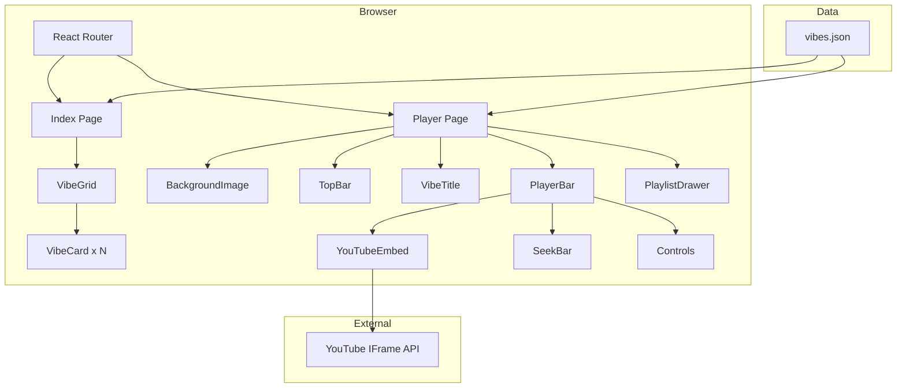
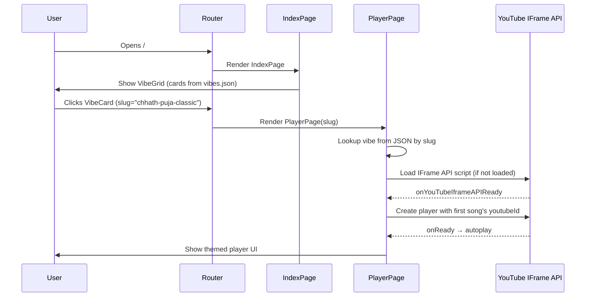
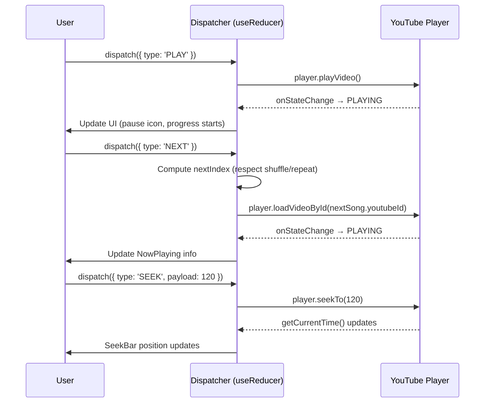

# Design Document: VibePlay App

## Overview

VibePlay is a mobile-first web music player organized around cultural "vibes" — moods like Chhath Puja, Honey Singh Bluetooth era, Kumar Sanu 90s nostalgia, etc. Users browse a gallery of vibe cards on the index page, tap one, and land on a full-screen themed player page that streams audio from YouTube via the IFrame Player API.

The app is a pure static React + Vite site with zero backend. Playlist data lives in a JSON file imported at build time. Routing is handled by react-router-dom with two routes: `/` (index) and `/vibe/:slug` (player). The entire bundle targets under 50 KB gzipped with only react, react-dom, and react-router-dom as dependencies.

## Architecture



## Sequence Diagrams

### App Boot & Navigation



### Playback Control Flow



## Components and Interfaces

### Component: App (Root)

**Purpose**: Mounts router, provides data context.

```typescript
// src/App.tsx
function App(): JSX.Element
// Routes: "/" → IndexPage, "/vibe/:slug" → PlayerPage
```

### Component: IndexPage

**Purpose**: Displays gallery of vibe cards.

```typescript
interface IndexPageProps {}
// Reads vibes[] from imported JSON
// Renders Header + VibeGrid + Footer
```

### Component: VibeCard

**Purpose**: Single card in the grid — links to player page.

```typescript
interface VibeCardProps {
  slug: string
  name: string
  nameHindi: string
  bgImage: string
  color: string
  songCount: number
}
```

**Responsibilities**:
- Render background image with overlay
- Show vibe title (Hindi) and song count
- Link to `/vibe/${slug}`

### Component: PlayerPage

**Purpose**: Full-screen themed music player for a single vibe.

```typescript
interface PlayerPageProps {}
// Reads slug from useParams()
// Looks up vibe from JSON
// Manages player state via useReducer
```

**Responsibilities**:
- Resolve vibe by slug (redirect to / if not found)
- Initialize YouTube player
- Own all player state (track index, playing, shuffle, repeat, volume, progress)
- Render BackgroundImage, TopBar, VibeTitle, PlayerBar, PlaylistDrawer

### Component: PlayerBar

**Purpose**: Glass-morphism bottom bar with playback controls.

```typescript
interface PlayerBarProps {
  currentSong: Song | null
  isPlaying: boolean
  progress: number       // 0-100
  currentTime: number    // seconds
  duration: number       // seconds
  shuffle: boolean
  repeat: RepeatMode
  volume: number         // 0-100
  onPlay: () => void
  onPause: () => void
  onNext: () => void
  onPrev: () => void
  onSeek: (seconds: number) => void
  onVolumeChange: (vol: number) => void
  onShuffleToggle: () => void
  onRepeatToggle: () => void
  onPlaylistToggle: () => void
}
```

### Component: PlaylistDrawer

**Purpose**: Slide-up panel listing all songs in the vibe.

```typescript
interface PlaylistDrawerProps {
  songs: Song[]
  currentIndex: number
  isOpen: boolean
  onSelect: (index: number) => void
  onClose: () => void
}
```

### Component: YouTubeEmbed

**Purpose**: Hidden iframe controlled via YT IFrame API.

```typescript
interface YouTubeEmbedProps {
  videoId: string
  onReady: (player: YT.Player) => void
  onStateChange: (state: number) => void
  onError: (errorCode: number) => void
}
```

**Responsibilities**:
- Load YT IFrame API script once (global singleton)
- Create/destroy player instance
- Expose imperative control via ref or callback

## Data Models

### Vibe

```typescript
interface Vibe {
  slug: string          // URL-safe identifier
  name: string          // English display name
  nameHindi: string     // Hindi/regional display name
  bgImage: string       // Path to WebP hero image
  color: string         // Hex accent color
  songs: Song[]         // Ordered playlist
}
```

**Validation Rules**:
- `slug` must be non-empty, lowercase, hyphen-separated
- `songs` must have at least 1 entry
- `bgImage` path must start with `/images/`
- `color` must be valid hex (#RRGGBB)

### Song

```typescript
interface Song {
  title: string         // Song title (may be Hindi)
  artist: string        // Artist/channel name
  youtubeId: string     // YouTube video ID (11 chars)
  duration: string      // "M:SS" or "MM:SS" format
}
```

**Validation Rules**:
- `youtubeId` must be exactly 11 characters
- `duration` must match pattern `/^\d{1,2}:\d{2}$/`
- `title` and `artist` must be non-empty

### PlayerState (useReducer)

```typescript
type RepeatMode = 'off' | 'all' | 'one'

interface PlayerState {
  trackIndex: number
  isPlaying: boolean
  shuffle: boolean
  repeat: RepeatMode
  volume: number           // 0–100
  currentTime: number      // seconds elapsed
  duration: number         // total seconds
  isDrawerOpen: boolean
  shuffleOrder: number[]   // pre-computed shuffle indices
}
```

## Algorithmic Pseudocode

### Player State Machine (useReducer)

```typescript
type PlayerAction =
  | { type: 'PLAY' }
  | { type: 'PAUSE' }
  | { type: 'NEXT' }
  | { type: 'PREV' }
  | { type: 'SEEK'; payload: number }
  | { type: 'SELECT_TRACK'; payload: number }
  | { type: 'TOGGLE_SHUFFLE' }
  | { type: 'TOGGLE_REPEAT' }
  | { type: 'SET_VOLUME'; payload: number }
  | { type: 'TIME_UPDATE'; payload: { current: number; duration: number } }
  | { type: 'TRACK_ENDED' }
  | { type: 'TOGGLE_DRAWER' }

function playerReducer(state: PlayerState, action: PlayerAction): PlayerState {
  switch (action.type) {
    case 'PLAY':
      return { ...state, isPlaying: true }

    case 'PAUSE':
      return { ...state, isPlaying: false }

    case 'NEXT':
      return { ...state, trackIndex: computeNextIndex(state), isPlaying: true }

    case 'PREV':
      // If >3s into song, restart. Else go previous.
      if (state.currentTime > 3) {
        return { ...state, currentTime: 0 }
      }
      return { ...state, trackIndex: computePrevIndex(state), isPlaying: true }

    case 'SEEK':
      return { ...state, currentTime: action.payload }

    case 'SELECT_TRACK':
      return { ...state, trackIndex: action.payload, isPlaying: true, currentTime: 0 }

    case 'TOGGLE_SHUFFLE':
      const shuffle = !state.shuffle
      return {
        ...state,
        shuffle,
        shuffleOrder: shuffle ? generateShuffleOrder(state.trackIndex, totalTracks) : []
      }

    case 'TOGGLE_REPEAT':
      const modes: RepeatMode[] = ['off', 'all', 'one']
      const next = modes[(modes.indexOf(state.repeat) + 1) % 3]
      return { ...state, repeat: next }

    case 'SET_VOLUME':
      return { ...state, volume: action.payload }

    case 'TIME_UPDATE':
      return { ...state, currentTime: action.payload.current, duration: action.payload.duration }

    case 'TRACK_ENDED':
      return handleTrackEnded(state)

    case 'TOGGLE_DRAWER':
      return { ...state, isDrawerOpen: !state.isDrawerOpen }
  }
}
```

**Preconditions:**
- `state` is a valid PlayerState
- `action.payload` values are within valid ranges

**Postconditions:**
- Returned state is a valid PlayerState
- No mutations to input state (immutable updates)
- `trackIndex` always within `[0, totalTracks - 1]`

### Next/Prev Index Computation

```typescript
function computeNextIndex(state: PlayerState, totalTracks: number): number {
  // Precondition: totalTracks > 0
  if (state.shuffle) {
    const currentShufflePos = state.shuffleOrder.indexOf(state.trackIndex)
    const nextShufflePos = currentShufflePos + 1
    if (nextShufflePos >= totalTracks) {
      return state.repeat === 'off' ? state.trackIndex : state.shuffleOrder[0]
    }
    return state.shuffleOrder[nextShufflePos]
  }
  const next = state.trackIndex + 1
  if (next >= totalTracks) {
    return state.repeat === 'off' ? state.trackIndex : 0
  }
  return next
}

function computePrevIndex(state: PlayerState, totalTracks: number): number {
  // Precondition: totalTracks > 0
  if (state.shuffle) {
    const currentShufflePos = state.shuffleOrder.indexOf(state.trackIndex)
    return currentShufflePos > 0
      ? state.shuffleOrder[currentShufflePos - 1]
      : state.shuffleOrder[totalTracks - 1]
  }
  return state.trackIndex > 0 ? state.trackIndex - 1 : totalTracks - 1
}
```

**Loop Invariants**: N/A (no loops — direct index computation)

**Postconditions:**
- Return value is always in `[0, totalTracks - 1]`
- When `repeat === 'off'` and at boundary, index stays (no wrap)

### Track Ended Handler

```typescript
function handleTrackEnded(state: PlayerState, totalTracks: number): PlayerState {
  switch (state.repeat) {
    case 'one':
      return { ...state, currentTime: 0, isPlaying: true }
    case 'all':
      return { ...state, trackIndex: computeNextIndex(state, totalTracks), currentTime: 0, isPlaying: true }
    case 'off':
      const nextIndex = computeNextIndex(state, totalTracks)
      if (nextIndex === state.trackIndex) {
        // At end of playlist, stop
        return { ...state, isPlaying: false, currentTime: 0 }
      }
      return { ...state, trackIndex: nextIndex, currentTime: 0, isPlaying: true }
  }
}
```

### Shuffle Order Generation (Fisher-Yates)

```typescript
function generateShuffleOrder(currentIndex: number, totalTracks: number): number[] {
  // Precondition: totalTracks > 0, currentIndex in [0, totalTracks-1]
  const order = Array.from({ length: totalTracks }, (_, i) => i)
  // Fisher-Yates shuffle
  for (let i = order.length - 1; i > 0; i--) {
    const j = Math.floor(Math.random() * (i + 1));
    [order[i], order[j]] = [order[j], order[i]]
  }
  // Move current track to front so it doesn't replay immediately
  const currentPos = order.indexOf(currentIndex)
  if (currentPos !== 0) {
    [order[0], order[currentPos]] = [order[currentPos], order[0]]
  }
  return order
}
```

**Postconditions:**
- Returned array is a permutation of `[0..totalTracks-1]`
- `order[0] === currentIndex` (current track is first)
- Length equals `totalTracks`

**Loop Invariant** (Fisher-Yates):
- After iteration `i`, elements at indices `[i..n-1]` are in their final shuffled position

### YouTube IFrame API Loader (Singleton)

```typescript
let apiLoadPromise: Promise<void> | null = null

function loadYouTubeAPI(): Promise<void> {
  if (apiLoadPromise) return apiLoadPromise
  if (window.YT && window.YT.Player) return Promise.resolve()

  apiLoadPromise = new Promise<void>((resolve) => {
    const script = document.createElement('script')
    script.src = 'https://www.youtube.com/iframe_api'
    script.async = true
    document.head.appendChild(script)
    ;(window as any).onYouTubeIframeAPIReady = () => resolve()
  })
  return apiLoadPromise
}
```

**Preconditions:** Called in browser environment (window exists)
**Postconditions:** `window.YT.Player` constructor is available after resolution

## Key Functions with Formal Specifications

### useVibePlayer (Custom Hook)

```typescript
function useVibePlayer(vibe: Vibe): {
  state: PlayerState
  dispatch: React.Dispatch<PlayerAction>
  playerRef: React.MutableRefObject<YT.Player | null>
}
```

**Preconditions:**
- `vibe` is a valid Vibe with at least 1 song
- Component is mounted (hook rules apply)

**Postconditions:**
- `state.trackIndex` is always valid for `vibe.songs`
- `playerRef.current` is either null (loading) or a valid YT.Player instance
- Dispatching actions synchronously updates state and triggers YT API calls as side effects

### formatTime

```typescript
function formatTime(seconds: number): string
// Precondition: seconds >= 0
// Postcondition: returns "M:SS" or "MM:SS" format string
// Examples: 0 → "0:00", 65 → "1:05", 600 → "10:00"
```

### parseDuration

```typescript
function parseDuration(duration: string): number
// Precondition: duration matches /^\d{1,2}:\d{2}$/
// Postcondition: returns total seconds as integer
// Examples: "5:39" → 339, "0:30" → 30
```

## Example Usage

```typescript
// src/data/vibes.json (imported at build time)
import vibes from './data/vibes.json'

// Index page — render cards
function IndexPage() {
  return (
    <div className="vibe-grid">
      {vibes.map(vibe => (
        <VibeCard key={vibe.slug} {...vibe} songCount={vibe.songs.length} />
      ))}
    </div>
  )
}

// Player page — full player
function PlayerPage() {
  const { slug } = useParams<{ slug: string }>()
  const vibe = vibes.find(v => v.slug === slug)
  if (!vibe) return <Navigate to="/" />

  const { state, dispatch, playerRef } = useVibePlayer(vibe)
  const currentSong = vibe.songs[state.trackIndex]

  return (
    <div className="player-page" style={{ '--accent': vibe.color } as React.CSSProperties}>
      <BackgroundImage src={vibe.bgImage} />
      <TopBar vibes={vibes} currentSlug={slug} />
      <VibeTitle text={vibe.nameHindi} />
      <PlayerBar
        currentSong={currentSong}
        isPlaying={state.isPlaying}
        progress={(state.currentTime / state.duration) * 100}
        currentTime={state.currentTime}
        duration={state.duration}
        shuffle={state.shuffle}
        repeat={state.repeat}
        volume={state.volume}
        onPlay={() => dispatch({ type: 'PLAY' })}
        onPause={() => dispatch({ type: 'PAUSE' })}
        onNext={() => dispatch({ type: 'NEXT' })}
        onPrev={() => dispatch({ type: 'PREV' })}
        onSeek={(s) => dispatch({ type: 'SEEK', payload: s })}
        onVolumeChange={(v) => dispatch({ type: 'SET_VOLUME', payload: v })}
        onShuffleToggle={() => dispatch({ type: 'TOGGLE_SHUFFLE' })}
        onRepeatToggle={() => dispatch({ type: 'TOGGLE_REPEAT' })}
        onPlaylistToggle={() => dispatch({ type: 'TOGGLE_DRAWER' })}
      />
      <PlaylistDrawer
        songs={vibe.songs}
        currentIndex={state.trackIndex}
        isOpen={state.isDrawerOpen}
        onSelect={(i) => dispatch({ type: 'SELECT_TRACK', payload: i })}
        onClose={() => dispatch({ type: 'TOGGLE_DRAWER' })}
      />
      <YouTubeEmbed
        videoId={currentSong.youtubeId}
        onReady={(p) => { playerRef.current = p }}
        onStateChange={(s) => { /* sync state */ }}
        onError={(e) => dispatch({ type: 'NEXT' })}
      />
    </div>
  )
}
```

## Correctness Properties

*A property is a characteristic or behavior that should hold true across all valid executions of a system — essentially, a formal statement about what the system should do. Properties serve as the bridge between human-readable specifications and machine-verifiable correctness guarantees.*

### Property 1: Track index always within bounds

*For any* valid PlayerState and any sequence of NEXT, PREV, SELECT_TRACK, or TRACK_ENDED actions, the resulting trackIndex SHALL always satisfy `0 <= trackIndex < vibe.songs.length`.

**Validates: Requirements 3.3, 3.5, 4.5, 5.3**

### Property 2: Shuffle order is a valid permutation with current track at front

*For any* PlayerState where shuffle is enabled, shuffleOrder SHALL be a permutation of [0..totalTracks-1] with length equal to totalTracks, all unique values in range, and shuffleOrder[0] equal to the track that was current when shuffle was enabled. When shuffle is disabled, shuffleOrder SHALL be an empty array.

**Validates: Requirements 4.1, 4.2**

### Property 3: Volume clamped within bounds

*For any* SET_VOLUME action with any numeric payload, the resulting state.volume SHALL satisfy `0 <= volume <= 100`.

**Validates: Requirements 3.7**

### Property 4: Repeat mode cycles deterministically

*For any* current RepeatMode, dispatching TOGGLE_REPEAT SHALL produce the next mode in the fixed cycle: off → all → one → off, regardless of any other state.

**Validates: Requirements 4.3**

### Property 5: Previous restarts track when past 3 seconds

*For any* PlayerState where currentTime > 3, dispatching PREV SHALL produce a state with currentTime = 0 and trackIndex unchanged.

**Validates: Requirements 3.4**

### Property 6: Track ended respects repeat mode

*For any* PlayerState, when TRACK_ENDED is dispatched: if repeat is "one", trackIndex is unchanged and isPlaying is true; if repeat is "all", trackIndex advances (wrapping) and isPlaying is true; if repeat is "off" and at the last track, isPlaying becomes false.

**Validates: Requirements 4.4, 4.5, 4.6**

### Property 7: YouTube API loader is a singleton

*For any* number of calls to loadYouTubeAPI(), the function SHALL return the same Promise reference, ensuring the script tag is appended at most once.

**Validates: Requirements 2.4**

### Property 8: Data validation accepts valid and rejects invalid

*For any* generated Vibe object, the validator SHALL accept it if and only if: slug is non-empty lowercase hyphen-separated, songs has at least 1 entry, bgImage starts with "/images/", color matches #RRGGBB, every youtubeId is exactly 11 characters, and every duration matches /^\d{1,2}:\d{2}$/.

**Validates: Requirements 9.1, 9.2, 9.3, 9.4, 9.5, 9.6**

### Property 9: Invalid slug produces redirect

*For any* string that does not match a slug in vibes.json, navigating to "/vibe/{string}" SHALL result in a redirect to the index page.

**Validates: Requirements 7.1**

## Error Handling

### Error: Invalid Slug in URL

**Condition**: User navigates to `/vibe/nonexistent-slug`
**Response**: Redirect to index page via `<Navigate to="/" />`
**Recovery**: User sees vibe gallery, can pick valid vibe

### Error: YouTube Video Unavailable

**Condition**: YT player fires `onError` (video removed, region-blocked, etc.)
**Response**: Auto-skip to next track via `dispatch({ type: 'NEXT' })`
**Recovery**: Playback continues with next song. If all songs fail, playback stops at last track.

### Error: YouTube IFrame API Fails to Load

**Condition**: Network error loading `iframe_api` script
**Response**: Show "Unable to load player" message in PlayerBar area
**Recovery**: User can reload page. No crash — UI remains navigable.

### Error: Empty Playlist

**Condition**: Vibe has 0 songs (shouldn't happen with valid data, but defensive)
**Response**: Show message "No songs in this vibe" instead of player controls
**Recovery**: User navigates back to index

## Testing Strategy

### Unit Testing Approach

- Test `playerReducer` pure function exhaustively (all action types)
- Test `computeNextIndex` / `computePrevIndex` with edge cases (first track, last track, shuffle on/off, repeat modes)
- Test `handleTrackEnded` for all repeat modes
- Test `generateShuffleOrder` produces valid permutation with current track at front
- Test `formatTime` and `parseDuration` utility functions

### Property-Based Testing Approach

**Library**: fast-check

- `trackIndex` stays in bounds after any sequence of NEXT/PREV/SELECT actions
- `shuffleOrder` is always a valid permutation of [0..n-1]
- `volume` stays in [0, 100] after any SET_VOLUME action
- Repeat mode cycles deterministically regardless of intermediate actions

### Integration Testing Approach

- Mount PlayerPage with mock vibe data, verify YouTube embed receives correct videoId on track change
- Verify navigation from IndexPage card to correct PlayerPage route
- Verify PlaylistDrawer opens/closes and selecting track dispatches correctly

## Performance Considerations

- **Bundle size**: Only 3 deps (react, react-dom, react-router-dom). Target <50 KB gzipped.
- **Images**: WebP format, lazy-loaded on index page. Player page bg is a single critical image.
- **YouTube API**: Loaded on-demand only when PlayerPage mounts (not on index page).
- **Re-renders**: PlayerBar receives primitive props. `TIME_UPDATE` dispatches at 1Hz (not every frame) via `setInterval` polling `player.getCurrentTime()`.
- **CSS**: No runtime CSS-in-JS. Plain CSS or CSS Modules — zero JS overhead for styles.
- **Fonts**: Google Fonts Noto Sans Devanagari loaded with `display=swap` to avoid FOIT.

## Security Considerations

- No user input persisted — static data only. No XSS vectors.
- YouTube embed sandboxed via iframe `allow` attributes.
- No API keys exposed (IFrame API is keyless).
- CSP headers recommended on hosting config to restrict script-src to self + youtube.com.
- No localStorage/sessionStorage used (stateless — refresh resets player).

## Dependencies

| Package | Purpose | Size Impact |
|---------|---------|-------------|
| react | UI rendering | ~2.5 KB gzipped (shared) |
| react-dom | DOM reconciliation | ~40 KB gzipped |
| react-router-dom | Client-side routing | ~10 KB gzipped |
| YouTube IFrame API | Playback engine | External script (no bundle impact) |

**Dev dependencies**: vite, @vitejs/plugin-react, typescript, fast-check (test only)

**Total runtime deps**: 3 packages. No UI library, no state management library, no CSS framework.
